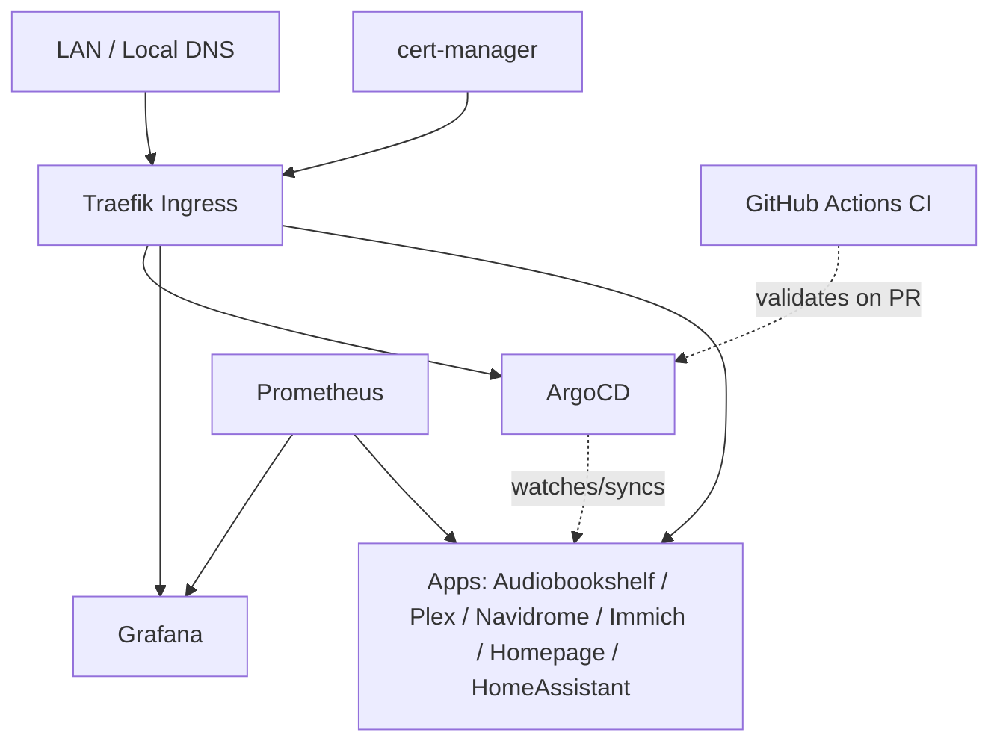

A self-hosted Kubernetes cluster (K3s) built as a hands-on learning environment for
DevOps and platform engineering — infrastructure, observability, GitOps, and
self-hosted applications, all managed as code.

## Background

This repo documents the cluster's evolution in infrastructure/DevOps:
what I built, what broke, and what I'd do differently at scale.

## Architecture

- **Cluster**: K3s, 2 nodes — bare metal, repurposed laptops running Ubuntu Server
- **Networking**: K3s built-in ServiceLB (Klipper) for LoadBalancer IPs, Traefik
  (K3s built-in addon) for ingress routing
- **TLS**: cert-manager + ClusterIssuer — Let's Encrypt (prod/staging split)
- **GitOps**: ArgoCD, Helm-installed, behind Traefik, LAN-only by design given its
  cluster-admin-level access
- **CI**: GitHub Actions — `helm template | kubeconform` validates all manifests on
  PR before merge to main
- **Service CIDR**: 10.43.0.0/16 · **Pod CIDR**: 10.42.0.0/16 (K3s defaults)
- **Sealed Secrets**: As required

## Repo structure

| Folder | What's in it |
|---|---|
| [`infra/`](./infra) | Cluster plumbing — cert-manager, Traefik, ArgoCD |
| [`monitoring/`](./monitoring) | Prometheus + Grafana observability stack |
| [`media/`](./media) | Self-hosted apps — Plex, Navidrome, Audiobookshelf, Immich |
| [`homepage/`](./homepage) | Dashboard / landing page for the cluster |
| [`homeassistant/`](./homeassistant) | Home automation — also the CI/CD pipeline reference app |

Each folder has its own README covering what the app is, why it's there, and any
gotchas hit while deploying it.

## GitOps status

ArgoCD manages all apps. Sync policy is `selfHeal: true`, `prune: false` across
the stack — self-healing proven stable, prune kept off deliberately until more
confidence in the full GitOps flow.

Considered the "app of apps" pattern (ArgoCD managing its own config and even the
underlying infra components recursively). Deliberately not adopting it at this
scale — it solves a team-coordination problem I don't have, and it would add a
layer of indirection that made this week's actual debugging harder, not easier.

**Worth reading if you want the real story, not just the outcome:** `homepage` was
the first app converted, and its first real sync caused a live outage — a stale,
manually-maintained rendered-manifest snapshot silently diverged from a working
manual fix, and ArgoCD correctly reverted to the (wrong) snapshot the moment it
synced. Root-caused, fixed properly (converted to a multi-source Application
rendering live from the chart + values file, snapshot deleted), and it's the reason
every app converted since has been checked the same careful way — confirm the real
chart source, confirm the values file actually has everything currently live,
review the diff before syncing. Full writeup: [`infra/argocd/README.md`](./infra/argocd)

## CI pipeline

Added as part of the Home Assistant deployment — first app built through a full
branch → PR → CI → merge → ArgoCD flow rather than a direct commit to main.

GitHub Actions runs on every PR to main:
- `helm template` renders each app's values file against its upstream chart
- `kubeconform` validates the rendered manifests against Kubernetes 1.32 schemas
- `--ignore-missing-schemas` handles Traefik and other CRD types not in the
  upstream schema set

A bad values file or invalid manifest now fails the PR check before ArgoCD
ever sees it. Workflow: [`.github/workflows/helm-lint.yaml`](./.github/workflows/helm-lint.yaml)

## How this evolved

Started with an old Raspberry Pi running Pi-hole. Transitioned to two Pis clustered
running Technitium for DNS. Had time and two old machines lying around, so deployed
K3s to regain some control over data staying in-house rather than on third-party
services. Added Homepage first, then worked through the standard self-hosted media
apps with proper TLS. Built GitOps proficiency (ArgoCD) on top of the existing
stack, then added CI validation on top of that — each layer added only once the
previous one was stable and understood.

## What's next / known gaps

- [x] ~~No GitOps~~ — ArgoCD managing all apps
- [x] ~~No CI~~ — GitHub Actions validating manifests on PR via kubeconform
- [x] ~~Sync policy manual everywhere~~ — `selfHeal: true` across the stack
- [x] Per-app READMEs complete
- [ ] PV via NFS works for media; final backup strategy and full cluster
      persistence story still to be finalized
- [ ] 2-node cluster; considering a low-power 3-node HA setup down the line
- [ ] Eventual home network overhaul (Mikrotik)
- [ ] Image scanning / policy enforcement (Trivy, Kyverno) — not yet in pipeline
- [ ] Postgres backup strategy for Immich metadata
